# Charan Achanta

**Developer · AI/ML Builder · Full-Stack Engineer**

[github](https://github.com/charanachanta2)

> Computer Science student building practical software across AI, full-stack development, and intelligent systems. 
> I like turning ambitious ideas into working products.

I build projects that combine software engineering with AI and real-world use cases. 
Right now, a major focus is **LifeLink AI** — an emergency and healthcare platform designed around 
patient records, nearby emergency services, analytics, AI assistance, SOS workflows, and connected healthcare services.

I also experiment with developer tools, analytics platforms, local AI systems, mobile applications, 
machine learning projects, and infrastructure.

<samp>python &nbsp; javascript &nbsp; flask &nbsp; node.js &nbsp; react native &nbsp; html &nbsp; css &nbsp; mongodb &nbsp; sqlite &nbsp; firebase &nbsp; docker &nbsp; git &nbsp; linux &nbsp; ai/ml</samp>

**[LifeLinkAI](https://github.com/charanachanta2/LifeLinkAI)** &nbsp;·&nbsp; <samp>healthcare, ai, full-stack</samp> 
Emergency and healthcare platform connecting patients with medical records, 
analytics, nearby emergency services, AI assistance, SOS features, and healthcare providers.

**[LocalGPT](https://github.com/charanachanta2/LocalGPT)** &nbsp;·&nbsp; <samp>ai, llm, local inference</samp> 
Local AI experimentation focused on running language-model-powered features 
with greater control over the model and application stack.

**[Multi-Tenant-Analytics-Platform](https://github.com/charanachanta2/Multi-Tenant-Analytics-Platform)** &nbsp;·&nbsp; <samp>flask, analytics, websocket</samp> 
Multi-tenant analytics platform for isolated tenant data, metric ingestion, 
real-time dashboards, and embeddable analytics experiences.

**[vitap_student_app](https://github.com/charanachanta2/vitap_student_app)** &nbsp;·&nbsp; <samp>mobile, student tools</samp> 
Student-focused application built around making useful campus information 
and workflows easier to access from a mobile experience.

**[Stock-Prediction-System](https://github.com/charanachanta2/Stock-Prediction-System)** &nbsp;·&nbsp; <samp>machine learning, python</samp> 
Machine-learning project exploring data-driven stock prediction and 
the practical application of predictive models to financial time-series data.

**[Adaptive-Priority-Cycle-Scheduling](https://github.com/charanachanta2/Adaptive-Priority-Cycle-Scheduling)** &nbsp;·&nbsp; <samp>algorithms, operating systems</samp> 
An experimental CPU scheduling project exploring adaptive priority and 
cycle-based scheduling behavior.

This profile keeps the same minimal, developer-focused visual system as the reference README, 
but intentionally removes the portrait and keeps the focus on projects, technologies, and activity.

The stat graphics and section headings are local SVG assets rather than third-party README cards. 
The included generator script can be adapted to refresh GitHub activity graphics automatically.

Built for **[charanachanta2](https://github.com/charanachanta2)**.
